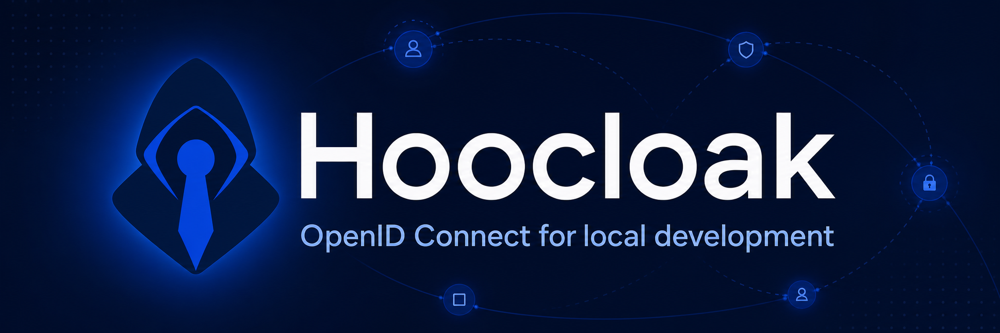
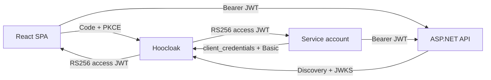

# Hoocloak

Hoocloak is a deliberately small OpenID Connect provider for local development. It gives browser SPAs an Authorization Code + PKCE login and gives service accounts an OAuth 2.0 client-credentials flow. APIs validate short-lived RS256 JWTs through standard discovery and JWKS.

> **Development only.** Hoocloak keeps each realm's signing key, authorization state, refresh-token families, and revocations in memory and rotates every realm signing key on restart. It has no durable sessions, administration UI/API, federation, MFA, registration, recovery, or production availability guarantees.



## Quick start

Requirements: Docker with Compose and browser support for reserved `.localhost` names.

```bash
docker compose up --build --wait
```

The Compose stack defaults to trusted development identity selection. To exercise
normal username/password authentication instead, start it with:

```bash
HOOCLOAK_LOGIN_MODE=password docker compose up --build --wait
```

Open <http://localhost:3000/>. The examples use:

| Principal | Credential | Authorization |
|---|---|---|
| `alice` | `alice-password` | role `admin`, permission `api.read` |
| `bob` | `bob-password` | role `reader`, permission `api.read` |
| `example-worker` | `dev-secret` | role `worker`, permission `api.read` |

Endpoints for the `development` realm:

- Issuer: `http://hoocloak.localhost:8080/realms/development`
- Discovery: <http://hoocloak.localhost:8080/realms/development/.well-known/openid-configuration>
- JWKS: <http://hoocloak.localhost:8080/realms/development/keys>
- Example API: <http://api.localhost:5099/api/public>

Compose publishes all example ports on `127.0.0.1` only, waits for service health, and runs every container with a read-only root filesystem, no Linux capabilities, and `no-new-privileges` (using memory-backed `/tmp` only where required). Check a standalone provider with:

```bash
hoocloak health --url http://127.0.0.1:8080/ready
```

Stop the stack with:

```bash
docker compose down --remove-orphans
```

Run the full browser suite against isolated stacks:

```bash
npm ci
npx playwright install
npm run e2e
```

Playwright allocates three available loopback ports for the SPA, API, and
provider on each invocation, so the normal development stack can remain
running and parallel suites do not share a Compose project. Set the distinct
`E2E_SPA_PORT`, `E2E_API_PORT`, and `E2E_PROVIDER_PORT` variables to override
the allocated ports; set `COMPOSE_PROJECT_NAME` to override the generated
project name. The suite starts and stops fresh password and identity-selection
Compose stacks automatically and exercises Chromium, Firefox, and WebKit.
Reports are written to `playwright-report/`; failure artifacts are written to
`test-results/`.

Print the binary version with `hoocloak version`. Local builds use the version
in [`internal/version/version`](internal/version/version); release images stamp
the same released version into the binary. Published images support
`linux/amd64` and `linux/arm64`; their OCI layers use Zstandard compression.

If your host does not resolve `api.localhost` and `hoocloak.localhost` to loopback, map both names to `127.0.0.1`. Keep the complete realm issuer byte-for-byte identical in the browser, API, and provider; for the runnable examples that is `http://hoocloak.localhost:8080/realms/development`.

## Helm

The chart in [`charts/hoocloak`](charts/hoocloak) deploys the provider as a
single hardened pod. Hoocloak deliberately supports exactly one replica because
each realm's signing key, authorization state, refresh-token families, and revocations are
kept in memory.

Create a Secret containing a complete Hoocloak configuration, then install the
chart with that Secret. This keeps bcrypt password and client-secret hashes out
of the Helm release:

```bash
kubectl create namespace hoocloak
kubectl -n hoocloak create secret generic hoocloak-config \
  --from-file=config.yaml=examples/hoocloak.yaml
helm install hoocloak ./charts/hoocloak \
  --namespace hoocloak \
  --set existingConfigSecret=hoocloak-config
kubectl -n hoocloak port-forward svc/hoocloak 8080:8080
```

The inline default configuration contains no users. Configure users explicitly
for isolated local clusters, or prefer `existingConfigSecret` for shared
clusters. Increment `existingConfigSecretVersion` after updating an external
Secret to restart the pod and reload its immutable subPath mount. Optional
Ingress, service-account, image digest, scheduling, resource, probe, and
security-context settings are available in
[`values.yaml`](charts/hoocloak/values.yaml). When enabling Ingress, terminate
TLS there. With inline configuration, set `hoocloakConfig.base_url` to the exact
external HTTPS root URL, including its trailing slash. With
`existingConfigSecret`, set `existingConfigBaseURL` to that same URL so the
chart can assert that it exactly matches the single Ingress host. Realm issuers
are derived beneath it as `{base_url}realms/{realm-name}`.

## Configuration

`hoocloak serve --config ./hoocloak.yaml` loads immutable YAML before opening a socket. Unknown fields and unsafe client settings are rejected. See [`examples/hoocloak.yaml`](examples/hoocloak.yaml) for the complete runnable configuration.

```yaml
base_url: http://hoocloak.localhost:8080/
listen: 0.0.0.0:8080
tokens:
  access_ttl: 5m
  id_ttl: 5m
  refresh_ttl: 8h
realms:
  - name: development
    users:
      - id: alice
        username: alice
        password_hash: "$2a$..."
        name: Alice Admin
        email: alice@example.test
        email_verified: true
        roles: [admin]
        permissions: [api.read]
    clients:
      - id: react-spa
        type: spa
        redirect_uris: [http://localhost:3000/auth/callback]
        post_logout_redirect_uris: [http://localhost:3000/auth/logout/callback]
        origins: [http://localhost:3000]
        audiences: [hoocloak-api]
        allowed_scopes: [openid, profile, email, offline_access, api.read]
```

This is a breaking configuration cutover: the former top-level `issuer`, `users`, and `clients` fields are not accepted. `base_url` is the process root and must end in `/`; each issuer is derived as `{base_url}realms/{name}`. Realm names must match `^[a-z0-9](?:[a-z0-9-]{0,61}[a-z0-9])?$`.

Users, clients, protocol state, signing keys, KIDs, JWKS, and CORS/CSP policy are isolated per realm. IDs and usernames may therefore repeat in different realms without sharing credentials or state. The listener, token TTLs, UI theme, and `HOOCLOAK_LOGIN_MODE` are process-wide. Operational probes remain global at root `/ready` and `/healthz`; they are not realm endpoints.

Generate password and client-secret hashes without putting plaintext in YAML:

```bash
printf '%s\n' 'a-local-secret' | hoocloak hash
```

The standalone binary and Helm chart default to normal username/password
authentication. Set `HOOCLOAK_LOGIN_MODE=select` for a standalone development
process, or `loginMode=select` in Helm, to replace the password form with a list
of configured users. Selecting an identity completes the same authorization
flow without checking its password. The supplied Compose stack is the inverse:
it defaults to `select`; start it in password mode with
`HOOCLOAK_LOGIN_MODE=password docker compose up --build --wait`.

The selection mode exposes every configured user on the login page and is
intended only for trusted development environments.

Cleartext HTTP is accepted only for loopback, `localhost`, and `.localhost` hosts. Non-local deployments must use HTTPS and preserve exact realm-issuer, redirect URI, post-logout URI, and CORS-origin equality.

## Provider login UI

The hosted login page is a small SolidJS application in [`ui/login`](ui/login). Hoocloak owns CSRF validation, login-mode enforcement, authentication, and the native form POST; the browser bundle only renders server-provided data attributes.

The embedded Hoocloak design remains the default. To override it without changing the binary or checked-in UI, point the configuration at an external theme directory and restart Hoocloak:

```yaml
ui:
  theme_dir: ./themes/aurora
```

Relative paths resolve from the YAML file. Omit `ui` to restore the embedded default. A theme package has this structure:

```text
themes/aurora/
├── login.html
├── logged-out.html
└── assets/
    ├── theme.css
    ├── theme.js
    └── logo.svg
```

`login.html` and `logged-out.html` are Go `html/template` files. Both receive `.BasePath`, such as `/realms/development`, and every form and asset URL must remain under that path. Login templates also receive `.RequestID`, `.Client`, `.CSRF`, `.Mode`, `.Username`, `.SelectedID`, `.Identities`, and `.Error`. They must preserve a native `POST {{.BasePath}}/login` form with `authRequestID` and `csrf`; password mode submits `username` and `password`, while selection mode submits `identity`. Files below `assets/` are served at `{{.BasePath}}/assets/`; root-relative `/login` and `/assets/` URLs are not supported. External URLs and inline scripts/styles remain blocked by the realm's CSP. Invalid, incomplete, or non-executable theme packages fail startup before the listener opens. Hoocloak still owns request lookup, bounded form parsing, CSRF validation, authentication, redirects, and error handling.

For Docker Compose, keep the normal stack untouched and layer the supplied override file over it. The theme is mounted read-only and selected through an absolute container path, so changing themes does not require rebuilding the image:

```bash
HOOCLOAK_THEME_DIR=/absolute/host/path/to/theme \
  docker compose -f compose.yaml -f compose.theme.yaml up --build --wait
```

`HOOCLOAK_UI_THEME_DIR` is also available for direct container runs and must be an absolute path. The YAML setting remains preferable outside containers because it supports paths relative to the configuration file.

Compiled `login.js` and `login.css` assets are checked in and embedded into the Go binary. Rebuild them after changing the UI:

```bash
npm ci --prefix ui/login
npm run build --prefix ui/login
go test -tags no_otel ./...
```

The root Dockerfile performs the SolidJS build before compiling Hoocloak, preventing stale assets in container images.

## Releases

Every commit must use the Conventional Commits format. After CI succeeds on
`main`, Hooversion derives and publishes the next semantic version:

- `feat:` creates a minor release.
- `fix:` and `perf:` create a patch release.
- `type!:` or a `BREAKING CHANGE:` footer creates a major release.
- Other commit types remain in history without forcing a release.

The release workflow updates `internal/version/version` and `CHANGELOG.md`,
creates a `chore(release):` commit, tags it, publishes a GitHub Release, and
pushes matching multi-platform images to `ghcr.io/openhoo/hoocloak` and
`openhoo/hoocloak` on Docker Hub with exact, major/minor, SHA, and `latest`
tags. Release commits do not recursively trigger another release.

If chart, image, or GitHub Release publication fails after Hooversion has pushed
the release commit and tag, rerun this workflow manually with `dry_run` disabled.
Before running Hooversion, the workflow recognizes a retry only when current
`main` has the exact subject `chore(release): hoocloak <version>` for the version
in `internal/version/version` and its forced-fetched `v<version>` tag points to
that same commit. Because the GitHub-token-authored release commit does not run
CI, a recognized retry requires successful push CI for its first parent. Any
ordinary manual publication still requires successful push CI for current
`main`; missing or mismatched retry tags fail without publishing.

## License

[MIT](LICENSE)

## React integration

The runnable integration is [`examples/react-spa`](examples/react-spa). Its essential settings are:

```ts
{
  authority: "http://hoocloak.localhost:8080/realms/development",
  client_id: "react-spa",
  redirect_uri: `${window.location.origin}/auth/callback`,
  post_logout_redirect_uri: `${window.location.origin}/auth/logout/callback`,
  response_type: "code",
  scope: "openid profile email offline_access api.read",
  automaticSilentRenew: true,
  monitorSession: false,
}
```

Use PKCE, store user and transaction state in `sessionStorage`, clean callback URLs after processing, and send only the access token to the API. Decoded browser claims are debugging data—not authorization evidence.

## ASP.NET integration

The runnable .NET 10 API is [`examples/aspnet-api`](examples/aspnet-api). It uses normal discovery/JWKS resolution:

```json
{
  "Oidc": {
    "Authority": "http://hoocloak.localhost:8080/realms/development",
    "Audience": "hoocloak-api"
  },
  "Cors": {
    "Origin": "http://localhost:3000"
  }
}
```

The example maps `role` as the role claim, requires `permission=api.read`, accepts only RS256 access tokens for `hoocloak-api`, and demonstrates the expected distinction: missing/invalid tokens return 401, while a valid non-admin token at `/api/admin` returns 403.

## Service accounts

Hoocloak accepts service credentials only through HTTP Basic authentication. The scope must be nonempty and allow-listed.

```bash
TOKEN="$({ curl -fsS -u example-worker:dev-secret \
  -d 'grant_type=client_credentials&scope=api.read' \
  http://hoocloak.localhost:8080/realms/development/oauth/token; } | jq -er .access_token)"

curl -i -H "Authorization: Bearer $TOKEN" \
  http://api.localhost:5099/api/profile
```

## Stateless behavior and limits

- Access and ID tokens live for five minutes in the example; refresh families live for eight hours.
- Refresh tokens rotate once. Reusing an ancestor revokes the active family.
- Logout and revocation block refresh immediately, but cannot retract an already-issued self-contained JWT from an API validating locally. The example API adds 30 seconds of clock skew.
- Every provider restart creates a distinct new RSA key for each realm and loses all in-memory realm state. The Development API refreshes metadata on an unknown `kid`; it may continue accepting a pre-restart JWT from its last-known-good key cache until that token expires plus skew.
- There is no provider SSO cookie. A new top-level authorization request asks for credentials; same-tab continuity comes from the SPA refresh token in `sessionStorage`.
- Supported flows are Authorization Code with mandatory S256 PKCE, rotating SPA refresh tokens, RP-initiated logout/revocation with a validated ID-token hint, and Basic-authenticated `client_credentials`.
