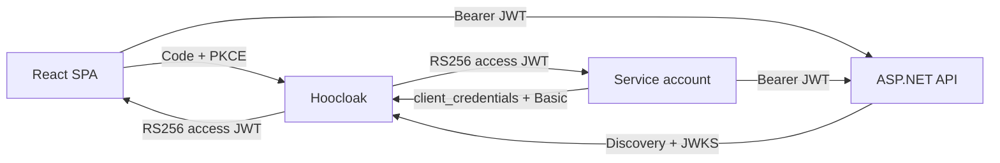

# Hoocloak

Hoocloak is a deliberately small OpenID Connect provider for local development. It gives browser SPAs an Authorization Code + PKCE login and gives service accounts an OAuth 2.0 client-credentials flow. APIs validate short-lived RS256 JWTs through standard discovery and JWKS.

> **Development only.** Hoocloak keeps signing keys, authorization state, refresh-token families, and revocations in memory and rotates the signing key on every restart. It has no durable sessions, administration UI/API, federation, MFA, registration, recovery, or production availability guarantees.



## Quick start

Requirements: Docker with Compose and browser support for reserved `.localhost` names.

```bash
docker compose up --build --wait
```

Open <http://localhost:3000/>. The examples use:

| Principal | Credential | Authorization |
|---|---|---|
| `alice` | `alice-password` | role `admin`, permission `api.read` |
| `bob` | `bob-password` | role `reader`, permission `api.read` |
| `example-worker` | `dev-secret` | role `worker`, permission `api.read` |

Endpoints:

- Issuer: `http://hoocloak.localhost:8080/`
- Discovery: <http://hoocloak.localhost:8080/.well-known/openid-configuration>
- JWKS: <http://hoocloak.localhost:8080/keys>
- Example API: <http://api.localhost:5099/api/public>

Compose publishes all example ports on `127.0.0.1` only, waits for service health, and runs every container with a read-only root filesystem, no Linux capabilities, and `no-new-privileges` (using memory-backed `/tmp` only where required). Check a standalone provider with:

```bash
hoocloak health --url http://127.0.0.1:8080/ready
```

Stop the stack with:

```bash
docker compose down --remove-orphans
```

Print the binary version with `hoocloak version`. Local builds use the version
in [`internal/version/version`](internal/version/version); release images stamp
the same released version into the binary. Published images support
`linux/amd64` and `linux/arm64`; their OCI layers use Zstandard compression.

If your host does not resolve `api.localhost` and `hoocloak.localhost` to loopback, map both names to `127.0.0.1`. Keep the issuer byte-for-byte identical in the browser, API, and provider.

## Configuration

`hoocloak serve --config ./hoocloak.yaml` loads immutable YAML before opening a socket. Unknown fields and unsafe client settings are rejected. See [`examples/hoocloak.yaml`](examples/hoocloak.yaml) for the complete runnable configuration.

```yaml
issuer: http://hoocloak.localhost:8080/
listen: 0.0.0.0:8080
tokens:
  access_ttl: 5m
  id_ttl: 5m
  refresh_ttl: 8h
users:
  - id: alice
    username: alice
    password_hash: "$2a$..."
    name: Alice Admin
    email: alice@example.test
    email_verified: true
    roles: [admin]
    permissions: [api.read]
clients:
  - id: react-spa
    type: spa
    redirect_uris: [http://localhost:3000/auth/callback]
    post_logout_redirect_uris: [http://localhost:3000/auth/logout/callback]
    origins: [http://localhost:3000]
    audiences: [hoocloak-api]
    allowed_scopes: [openid, profile, email, offline_access, api.read]
```

Generate password and client-secret hashes without putting plaintext in YAML:

```bash
printf '%s\n' 'a-local-secret' | hoocloak hash
```

Set `HOOCLOAK_LOGIN_MODE=select` in development to replace the password form with a list of configured users. Selecting an identity completes the same authorization flow without checking its password. Omit the variable or set it to `password` to keep normal username/password authentication.

```yaml
services:
  hoocloak:
    environment:
      HOOCLOAK_LOGIN_MODE: select
```

The selection mode exposes every configured user on the login page and is intended only for trusted development environments.

Cleartext HTTP is accepted only for loopback, `localhost`, and `.localhost` hosts. Non-local deployments must use HTTPS and preserve exact issuer, redirect URI, post-logout URI, and CORS-origin equality.

## Provider login UI

The hosted login page is a small SolidJS application in [`ui/login`](ui/login). Hoocloak owns CSRF validation, login-mode enforcement, authentication, and the native form POST; the browser bundle only renders server-provided data attributes.

The embedded Hoocloak design remains the default. To override it without changing the binary or checked-in UI, point the configuration at an external theme directory and restart Hoocloak:

```yaml
ui:
  theme_dir: ./themes/aurora
```

Relative paths resolve from the YAML file. Omit `ui` to restore the embedded default. A theme package has this structure:

```text
themes/aurora/
├── login.html
├── logged-out.html
└── assets/
    ├── theme.css
    ├── theme.js
    └── logo.svg
```

`login.html` and `logged-out.html` are Go `html/template` files. Login templates receive `.RequestID`, `.Client`, `.CSRF`, `.Mode`, `.Username`, `.SelectedID`, `.Identities`, and `.Error`. They must preserve a native `POST /login` form with `authRequestID` and `csrf`; password mode submits `username` and `password`, while selection mode submits `identity`. Files below `assets/` are served at `/assets/`; external URLs and inline scripts/styles remain blocked by the provider CSP. Invalid, incomplete, or non-executable theme packages fail startup before the listener opens. Hoocloak still owns request lookup, bounded form parsing, CSRF validation, authentication, redirects, and error handling.

For Docker Compose, keep the normal stack untouched and layer the supplied override file over it. The theme is mounted read-only and selected through an absolute container path, so changing themes does not require rebuilding the image:

```bash
HOOCLOAK_THEME_DIR=/absolute/host/path/to/theme \
  docker compose -f compose.yaml -f compose.theme.yaml up --build --wait
```

`HOOCLOAK_UI_THEME_DIR` is also available for direct container runs and must be an absolute path. The YAML setting remains preferable outside containers because it supports paths relative to the configuration file.

Compiled `login.js` and `login.css` assets are checked in and embedded into the Go binary. Rebuild them after changing the UI:

```bash
npm ci --prefix ui/login
npm run build --prefix ui/login
go test -tags no_otel ./...
```

The root Dockerfile performs the SolidJS build before compiling Hoocloak, preventing stale assets in container images.

## Releases

Every commit must use the Conventional Commits format. After CI succeeds on
`main`, Hooversion derives and publishes the next semantic version:

- `feat:` creates a minor release.
- `fix:` and `perf:` create a patch release.
- `type!:` or a `BREAKING CHANGE:` footer creates a major release.
- Other commit types remain in history without forcing a release.

The release workflow updates `internal/version/version` and `CHANGELOG.md`,
creates a `chore(release):` commit, tags it, publishes a GitHub Release, and
pushes `ghcr.io/openhoo/hoocloak` with exact, major/minor, SHA, and `latest`
tags. Release commits do not recursively trigger another release.

## License

[MIT](LICENSE)

## React integration

The runnable integration is [`examples/react-spa`](examples/react-spa). Its essential settings are:

```ts
{
  authority: "http://hoocloak.localhost:8080/",
  client_id: "react-spa",
  redirect_uri: `${window.location.origin}/auth/callback`,
  post_logout_redirect_uri: `${window.location.origin}/auth/logout/callback`,
  response_type: "code",
  scope: "openid profile email offline_access api.read",
  automaticSilentRenew: true,
  monitorSession: false,
}
```

Use PKCE, store user and transaction state in `sessionStorage`, clean callback URLs after processing, and send only the access token to the API. Decoded browser claims are debugging data—not authorization evidence.

## ASP.NET integration

The runnable .NET 10 API is [`examples/aspnet-api`](examples/aspnet-api). It uses normal discovery/JWKS resolution:

```json
{
  "Oidc": {
    "Authority": "http://hoocloak.localhost:8080/",
    "Audience": "hoocloak-api"
  },
  "Cors": {
    "Origin": "http://localhost:3000"
  }
}
```

The example maps `role` as the role claim, requires `permission=api.read`, accepts only RS256 access tokens for `hoocloak-api`, and demonstrates the expected distinction: missing/invalid tokens return 401, while a valid non-admin token at `/api/admin` returns 403.

## Service accounts

Hoocloak accepts service credentials only through HTTP Basic authentication. The scope must be nonempty and allow-listed.

```bash
TOKEN="$({ curl -fsS -u example-worker:dev-secret \
  -d 'grant_type=client_credentials&scope=api.read' \
  http://hoocloak.localhost:8080/oauth/token; } | jq -er .access_token)"

curl -i -H "Authorization: Bearer $TOKEN" \
  http://api.localhost:5099/api/profile
```

## Stateless behavior and limits

- Access and ID tokens live for five minutes in the example; refresh families live for eight hours.
- Refresh tokens rotate once. Reusing an ancestor revokes the active family.
- Logout and revocation block refresh immediately, but cannot retract an already-issued self-contained JWT from an API validating locally. The example API adds 30 seconds of clock skew.
- Every provider restart creates a new RSA key and loses all in-memory state. The Development API refreshes metadata on an unknown `kid`; it may continue accepting a pre-restart JWT from its last-known-good key cache until that token expires plus skew.
- There is no provider SSO cookie. A new top-level authorization request asks for credentials; same-tab continuity comes from the SPA refresh token in `sessionStorage`.
- Supported flows are Authorization Code with mandatory S256 PKCE, rotating SPA refresh tokens, RP-initiated logout/revocation with a validated ID-token hint, and Basic-authenticated `client_credentials`.
