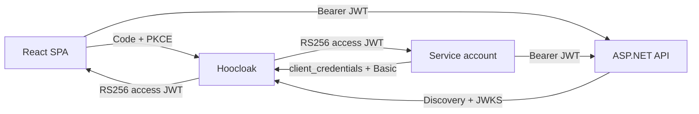

# Hoocloak

Hoocloak is a deliberately small OpenID Connect provider for local development. It gives browser SPAs an Authorization Code + PKCE login and gives service accounts an OAuth 2.0 client-credentials flow. APIs validate short-lived RS256 JWTs through standard discovery and JWKS.

> **Development only.** Hoocloak keeps each realm's signing key, authorization state, refresh-token families, access-token activity metadata, and revocations in memory. A restart rotates every realm key and loses that state. Hoocloak has no durable sessions, administration UI/API, federation, MFA, registration, recovery, or production availability guarantees.



## Navigation

- [Quick start](#quick-start)
- [Prerequisites](#prerequisites)
- [CLI reference](#cli-reference)
- [Configuration](#configuration)
- [Protocol reference](#protocol-reference)
- [Integrations](#integrations)
- [Helm](#helm)
- [Provider login UI and themes](#provider-login-ui-and-themes)
- [Browser E2E](#browser-e2e)
- [State and security limits](#state-and-security-limits)
- [Contributing](#contributing)
- [Releases](#releases)
- [License](#license)

## Quick start

The turnkey path requires only Docker with Compose and a browser that supports reserved `.localhost` names:

```bash
docker compose up --build --wait
```

Compose defaults to trusted development identity selection. To exercise normal username/password authentication instead:

```bash
HOOCLOAK_LOGIN_MODE=password docker compose up --build --wait
```

Open <http://localhost:3000/>. The examples use:

| Principal | Credential | Authorization |
|---|---|---|
| `alice` | `alice-password` | role `admin`, permission `api.read` |
| `bob` | `bob-password` | role `reader`, permission `api.read` |
| `example-worker` | `dev-secret` | role `worker`, permission `api.read` |

Development-realm addresses:

- Issuer: `http://hoocloak.localhost:8080/realms/development`
- Discovery: <http://hoocloak.localhost:8080/realms/development/.well-known/openid-configuration>
- JWKS: <http://hoocloak.localhost:8080/realms/development/keys>
- Example API: <http://api.localhost:5099/api/public>

Compose publishes ports on `127.0.0.1` only, waits for health, and runs every container with a read-only root filesystem, no Linux capabilities, and `no-new-privileges` (with memory-backed `/tmp` only where required). Run the provider's health client inside its container:

```bash
docker compose exec hoocloak /hoocloak health \
  --url http://127.0.0.1:8080/ready
```

Stop the stack with:

```bash
docker compose down --remove-orphans
```

If the host does not resolve `api.localhost` and `hoocloak.localhost` to loopback, map both names to `127.0.0.1`. Keep the complete realm issuer byte-for-byte identical in the browser, API, and provider.

## Prerequisites

Docker Compose quick start does **not** require a host Go, Node, .NET, Helm, or Bun installation. Install the following only for the corresponding source or maintainer work:

| Work | Required tools |
|---|---|
| Provider source | Go 1.26.x |
| Login UI, React example, or Playwright | Node.js 24.x and npm |
| ASP.NET API source | .NET SDK 10 |
| Chart development | Helm 4.2.3 and `kubectl` |
| Release/Hooversion tooling | Bun 1.3.14 |
| Service-account/API smoke commands | `curl` and `jq` |
| Browser E2E | Bash, normal POSIX utilities, Docker Compose, and a local or shared-filesystem Docker daemon that can bind-mount the generated configuration |

Build the standalone provider from the repository root before using the local CLI examples:

```bash
go build -tags no_otel -o ./hoocloak ./cmd/hoocloak
```

## CLI reference

| Command | Contract |
|---|---|
| `./hoocloak serve [--config path]` | Loads one strict YAML document before opening a socket. `--config` defaults to `./hoocloak.yaml`. |
| `./hoocloak hash` | Reads exactly one nonempty newline-terminated value from stdin and writes its bcrypt hash. EOF before the newline, an empty value, or any bytes after that one line are rejected. CRLF input is accepted as one line. |
| `./hoocloak health [--url URL] [--timeout duration]` | Defaults to `http://127.0.0.1:8080/ready` and `2s`. The URL must be absolute credential-free HTTP(S), timeout must be positive, redirects are not followed, and only a 2xx response succeeds. |
| `./hoocloak version` | Prints the embedded version. Local builds use [`internal/version/version`](internal/version/version); release builds stamp the released value. |

Generate a hash without placing plaintext in YAML:

```bash
printf '%s\n' 'a-local-secret' | ./hoocloak hash
```

## Configuration

`./hoocloak serve` loads immutable YAML with unknown-field and multiple-document rejection. See the complete runnable [`examples/hoocloak.yaml`](examples/hoocloak.yaml).

### Field reference

| Field | Required | Meaning |
|---|---:|---|
| `base_url` | yes | Process root URL, ending in `/`; realm issuers are `{base_url}realms/{name}`. |
| `listen` | yes | Provider listener as `host:port`. |
| `ui.theme_dir` | no | External theme directory. Relative YAML paths resolve from the configuration file. |
| `tokens.access_ttl` | yes | Positive Go duration for access JWTs and their activity metadata. |
| `tokens.id_ttl` | yes | Positive Go duration for ID tokens. |
| `tokens.refresh_ttl` | yes | Positive, absolute lifetime of a refresh-token family from its first issuance. |
| `realms[]` | yes | One or more isolated realms. |
| `realms[].name` | yes | Unique lowercase DNS-label-style name matching `^[a-z0-9](?:[a-z0-9-]{0,61}[a-z0-9])?$`. |
| `realms[].users[]` | no | Optional realm users; absent or empty is valid for service-only or empty realms. |
| `realms[].clients[]` | no | Optional realm SPA and service clients; absent or empty is valid. |
| `users[].id` | yes | Stable subject identifier; shares a per-realm namespace with client IDs. |
| `users[].username` | yes | Password-login name; unique per realm after Unicode case folding. |
| `users[].password_hash` | yes | Valid bcrypt hash, including when process-wide select mode is used. |
| `users[].name`, `email`, `email_verified` | no | Optional profile values. With the corresponding scope, omitted strings produce empty claim values and omitted `email_verified` produces `false`. |
| `users[].roles`, `permissions` | no | Optional unique authorization values; absent or empty is valid. Permissions are custom OAuth scope tokens, never reserved OIDC scopes. |
| `clients[].id`, `type` | yes | Stable client ID and either `spa` or `service`; ID shares the realm namespace with user IDs. |
| `clients[].name` | no | Display name used by the hosted login page; ID is the fallback. |
| `clients[].audiences` | yes | Nonempty unique JWT audiences. |
| `clients[].allowed_scopes` | yes | Nonempty unique allow-list of valid OAuth scope tokens. |
| `clients[].roles`, `permissions` | no | Service-account authorization values; permissions must be custom scopes. |
| `clients[].secret_hash` | by type | Required bcrypt hash for `service`; forbidden for `spa`. |
| `clients[].redirect_uris` | by type | Nonempty for `spa`; forbidden for `service`. |
| `clients[].post_logout_redirect_uris` | no | Exact allowed SPA post-logout redirects; forbidden for `service`. |
| `clients[].origins` | by type | Nonempty exact SPA browser origins; forbidden for `service`. |

Minimal shape showing both client types:

```yaml
base_url: http://hoocloak.localhost:8080/
listen: 0.0.0.0:8080
tokens:
  access_ttl: 5m
  id_ttl: 5m
  refresh_ttl: 8h
realms:
  - name: development
    users:
      - id: alice
        username: alice
        password_hash: "$2b$..."
        name: Alice Admin
        email: alice@example.test
        email_verified: true
        roles: [admin]
        permissions: [api.read]
    clients:
      - id: react-spa
        type: spa
        redirect_uris: [http://localhost:3000/auth/callback]
        post_logout_redirect_uris: [http://localhost:3000/auth/logout/callback]
        origins: [http://localhost:3000]
        audiences: [hoocloak-api]
        allowed_scopes: [openid, profile, email, offline_access, api.read]
      - id: example-worker
        type: service
        secret_hash: "$2b$..."
        name: Example Worker
        audiences: [hoocloak-api]
        allowed_scopes: [api.read]
        roles: [worker]
        permissions: [api.read]
```

### Validation rules

- Configuration `base_url`, redirects, and origins are absolute credential-free HTTP(S) URLs, reject wildcards and backslashes, and allow cleartext HTTP only for loopback, `localhost`, and `.localhost` hosts. Health CLI targets are separately validated as absolute credential-free HTTP(S) URLs and may use non-local HTTP.
- `base_url` is an exact root URL with trailing `/`. Redirects may have paths/query strings but no fragment. Origins have no path, query, or fragment and must use canonical lowercase scheme/host form, no trailing-dot host, and no explicit default port.
- `listen` must contain a numeric port from 1 through 65535. Token durations must be positive. Realms must be nonempty and uniquely named.
- Within a realm, user and client IDs share one exact-match namespace. Usernames reject surrounding whitespace and are unique after case folding. IDs and usernames may repeat in different realms because keys, clients, users, protocol state, and browser policy are realm-isolated.
- Bcrypt fields must parse as bcrypt hashes. Roles, permissions, audiences, and scopes reject empty, whitespace-padded, or duplicate values. Scope/permission strings must be valid printable OAuth scope tokens; permissions cannot use reserved OIDC scope names.
- Supported reserved scopes are `openid`, `profile`, `email`, and `offline_access`. `phone` and `address` are reserved but intentionally unsupported and rejected. Any other valid token is an application scope.
- SPA clients have no secret, must allow `openid`, and require redirects and origins. Service clients require a bcrypt secret, forbid browser redirect/origin fields and every reserved OIDC scope, and require every allowed custom scope to appear in that client's permissions.

### Environment overrides and login mode

The YAML is loaded first; environment overrides are applied afterward and the effective configuration is validated again:

| Variable | Effect |
|---|---|
| `HOOCLOAK_LOGIN_MODE=password\|select` | Process-wide login mode. Absent means `password`. Empty, padded, or other values fail startup. |
| `HOOCLOAK_UI_THEME_DIR=/absolute/path` | Overrides `ui.theme_dir`. It must be nonempty, unpadded, and absolute. |

`select` exposes every configured user and authenticates by ID without password verification. It records `amr=["dev-select"]` and is only for trusted development environments. Password mode records `amr=["pwd"]`. The standalone binary and Helm chart default to password; [`compose.yaml`](compose.yaml) defaults to select.

## Protocol reference

Every endpoint below is relative to `/realms/{realm}` unless marked root-only.

| Endpoint | Methods | Authentication and purpose |
|---|---|---|
| `/.well-known/openid-configuration` | GET, HEAD | Public discovery document. |
| `/keys` | GET | Public realm JWKS. |
| `/authorize` | GET, POST | Public SPA authorization entry; registered client/redirect, `response_type=code`, query response mode, `openid`, and S256 PKCE are mandatory. |
| `/oauth/token` | POST | SPA authorization-code/refresh requests use the public client; service `client_credentials` requires HTTP Basic and rejects credentials in form/query fields. |
| `/userinfo` | GET, POST | Bearer access token. If an `Origin` is sent, it must exactly match the owning SPA client's configured origins. |
| `/oauth/introspect` | POST | HTTP Basic client authentication; active metadata is returned only for a token owned by that client. |
| `/revoke` | POST | Public-SPA or Basic-authenticated service revocation. The submitted `token` is handled only within the owning client and unknown/foreign tokens are not disclosed. |
| `/end_session` | GET, POST | Requires a validated `id_token_hint`; post-logout redirect must belong to that client. Terminates provider state for the verified subject and client. |
| `/login` | GET, POST | Internal hosted-login endpoint. GET requires an active authorization request; form POST requires the matching CSRF cookie and mode-specific controls. |
| `/logged-out` | GET, HEAD | Realm-relative default signed-out page. |
| `/assets/*` | GET, HEAD | Realm-relative embedded or external theme assets. |
| `/healthz` | Any | Root-only liveness response; the current handler does not restrict the HTTP method. `/realms/{realm}/healthz` is intentionally 404. |
| `/ready` | Any | Root-only readiness across configured realm stores; the current handler does not restrict the HTTP method. `/realms/{realm}/ready` is intentionally 404. |

Token, introspection, and revocation endpoints are POST-only. Security-sensitive scalar parameters on authorize, token, introspection, revocation, end-session, and hosted-login submissions may occur only once. Applicable form bodies are capped at 64 KiB.

### Scopes and claims

- A SPA may request only its allow-listed scopes. Reserved scopes are granted as requested; each custom application scope is granted only when the selected user's `permissions` also contains it.
- A service must request a nonempty subset present in both its `allowed_scopes` and `permissions`.
- The `permission` claim is the granted custom-scope list. `role` comes from the user for human tokens and from the client for service tokens. Access tokens include `client_id` and the space-delimited `scope`; human tokens also carry `name` and `preferred_username`. Service tokens do not receive human profile claims.
- `profile` controls standard `name`/`preferred_username` userinfo and ID-token profile disclosure; `email` controls `email`/`email_verified`. Userinfo always includes `sub` for an active matching token.
- `offline_access` enables the SPA refresh flow; it does not make access JWTs opaque or remotely retractable.
- Discovery's `claims_supported` is the standard OIDC claim advertisement. It does not enumerate every Hoocloak private access-token authorization claim such as `client_id`, `scope`, `role`, or `permission`.

| Artifact/response | Intended use | Important claim behavior |
|---|---|---|
| SPA access JWT | API bearer token | User subject/roles; custom granted scopes become `permission`; contains audience, `client_id`, `scope`, `jti`, and RS256 signature. |
| Service access JWT | API bearer token | Subject and `client_id` are the service client; client roles and requested custom scopes become `role`/`permission`; no human profile. |
| SPA ID token | Client session and logout hint, not API authorization | OIDC identity claims; profile/email disclosure follows scopes. |
| Refresh token | Rotate a SPA token family | Opaque, single-use, and bound to its original subject/client/family. |
| Userinfo | Live provider lookup | Requires active access metadata; fields are scope-conditioned and browser origin is checked when present. |
| Introspection | Owning-client live lookup | Active only while matching subject/client access metadata remains. |

### Authorization, refresh, logout, and revocation state

- Authorization requests and their codes share a five-minute lifetime. `prompt=none` returns `login_required` because Hoocloak has no provider SSO cookie.
- A failed code exchange caused by a bad verifier, client, or redirect does not consume the code, so the correct exchange may be retried. A successful exchange is exact-once; concurrent valid redemption permits only one success.
- Refresh-family lifetime is absolute and non-sliding: rotation never extends the deadline created at first issuance. Each refresh token is single-use. Reusing an ancestor revokes the family.
- Successful rotation removes the predecessor access token's provider metadata. Family replay, revocation, or end-session removes family access metadata, causing userinfo/introspection to reject it immediately.
- End-session is scoped to the verified ID-token subject plus client. Revocation and introspection are restricted to the owning client. Revocation uses a submitted access/refresh token and client authentication rules; it does **not** use the logout ID-token hint.
- Metadata invalidation does not retract an already-issued self-contained access JWT from an offline API that validates signature, issuer, audience, and expiry locally. Restart/key-cache behavior has the same distinction.

## Integrations

### React SPA

The turnkey integration is the root Compose stack. Source is in [`examples/react-spa`](examples/react-spa) and uses `oidc-client-ts` through `react-oidc-context` with Authorization Code + S256 PKCE:

```ts
{
  authority: "http://hoocloak.localhost:8080/realms/development",
  client_id: "react-spa",
  redirect_uri: `${window.location.origin}/auth/callback`,
  post_logout_redirect_uri: `${window.location.origin}/auth/logout/callback`,
  response_type: "code",
  scope: "openid profile email offline_access api.read",
  automaticSilentRenew: true,
  monitorSession: false,
  revokeTokensOnSignout: true,
}
```

The example stores user data (including access, ID, and refresh tokens) and OIDC transaction state in tab-scoped `sessionStorage`. Sign-in and sign-out callbacks replace the callback URL with a sanitized same-origin `returnTo`; unsafe absolute, scheme-relative, and backslash paths fall back to `/`. Logout attempts token revocation before RP-initiated end-session and handles `/auth/logout/callback`. Static hosting must route callback/history paths to the SPA entry document; the supplied [`nginx.conf`](examples/react-spa/nginx.conf) uses an `index.html` fallback. Send only the access token to APIs; decoded browser claims are diagnostic data, not authorization evidence.

Standalone source requires Node 24.x/npm and coordinated ports. The checked-in provider/API configuration expects the SPA on port 3000, while Vite's project default is 5173, so override it:

Development server alternative:

```bash
npm ci --prefix examples/react-spa
npm --prefix examples/react-spa run dev -- --port 3000
```

Build-and-preview alternative:

```bash
npm ci --prefix examples/react-spa
npm --prefix examples/react-spa run build
npm --prefix examples/react-spa run preview -- --port 3000
```

Run the provider on `8080` and the API on `5099` at the same time; otherwise adjust the SPA environment and the matching provider redirect/origin and API CORS settings together.

### ASP.NET API

The root Compose stack is the turnkey path. The source example in [`examples/aspnet-api`](examples/aspnet-api) targets .NET 10 and uses standard discovery/JWKS resolution from [`appsettings.json`](examples/aspnet-api/appsettings.json):

```json
{
  "Oidc": {
    "Authority": "http://hoocloak.localhost:8080/realms/development",
    "Audience": "hoocloak-api"
  },
  "Cors": {
    "Origin": "http://localhost:3000"
  }
}
```

Local HTTP is accepted only when `ASPNETCORE_ENVIRONMENT=Development` and the authority/origin host is loopback, `localhost`, or `.localhost`. Authority must be an absolute credential-free URL whose path is exactly `/realms/<valid-realm>` and has no query/fragment. CORS origin must be an exact HTTP(S) origin without credentials, path, query, or fragment. Other environments require HTTPS.

The JWT handler validates issuer, audience, signing key, lifetime, RS256, and a 30-second clock skew. Its additional access-token shape gate requires nonempty `jti` and `scope` and rejects `azp`, preventing ID tokens from being accepted as API access tokens.

| Endpoint | Policy | Result |
|---|---|---|
| `GET /api/public` | none | 200 |
| `GET /api/profile` | valid access token + `permission=api.read` | 200; missing/invalid token is 401, valid token lacking permission is 403 |
| `GET /api/admin` | profile policy + `role=admin` | 200; missing/invalid token is 401, valid non-admin token is 403 |

Standalone API source requires the .NET 10 SDK:

```bash
ASPNETCORE_ENVIRONMENT=Development \
  dotnet run --project examples/aspnet-api/Hoocloak.AspNetApi.csproj \
  --urls http://0.0.0.0:5099
```

### Service accounts

Service credentials are accepted only through HTTP Basic. The requested scope must be nonempty and be present in both the client's allow-list and permissions:

This smoke workflow requires `curl` and `jq` on the host.

```bash
TOKEN="$({ curl -fsS -u example-worker:dev-secret \
  -d 'grant_type=client_credentials&scope=api.read' \
  http://hoocloak.localhost:8080/realms/development/oauth/token; } | jq -er .access_token)"

curl -i -H "Authorization: Bearer $TOKEN" \
  http://api.localhost:5099/api/profile
```

## Helm

The chart in [`charts/hoocloak`](charts/hoocloak) deploys exactly one pod. It must remain single-replica because each realm's RSA key and protocol state are process memory. The Deployment uses `Recreate`, so upgrades are disruptive: pod replacement causes downtime, rotates keys, and loses authorization requests, refresh families, access activity, and revocation state.

### Installing configuration

For shared clusters, create a complete configuration Secret in the release namespace and reference it:

```bash
kubectl create namespace hoocloak
kubectl -n hoocloak create secret generic hoocloak-config \
  --from-file=config.yaml=examples/hoocloak.yaml
helm install hoocloak ./charts/hoocloak \
  --namespace hoocloak \
  --set existingConfigSecret=hoocloak-config
```

`existingConfigSecretKey` selects the key (default `config.yaml`). The chart does not create or inspect an external Secret. After changing its data, increment `existingConfigSecretVersion` and run `helm upgrade`; this changes a pod checksum and reloads the immutable `subPath` mount. Inline `hoocloakConfig` instead creates a Helm-managed Secret and changes roll the pod automatically, but hashes and all inline values are then represented in Helm release state.

`existingConfigBaseURL` is an operator assertion used only for Ingress validation; the chart cannot compare it with the Secret's actual `base_url`. Keep them identical yourself.

Published releases attach one `hoocloak-<version>.tgz` chart archive to the corresponding GitHub Release. Download it and install by local path:

```bash
helm install hoocloak ./hoocloak-<version>.tgz --namespace hoocloak --create-namespace
```

There is no published Helm repository or OCI chart endpoint.

### Ingress

Ingress supports one lowercase DNS host, root path `/` with `Prefix`, and TLS covering that exact host. The asserted/configured base URL must be exactly `https://<host>/`:

```yaml
existingConfigSecret: hoocloak-config
existingConfigBaseURL: https://login.example.test/
ingress:
  enabled: true
  className: nginx
  annotations: {}
  hosts:
    - host: login.example.test
      paths:
        - path: /
          pathType: Prefix
  tls:
    - secretName: login-example-test-tls
      hosts:
        - login.example.test
```

For inline configuration, set `hoocloakConfig.base_url` instead of `existingConfigBaseURL`.

### Runtime and values contract

- Default pod security: UID/GID/fsGroup `65532`, `fsGroupChangePolicy: OnRootMismatch`, `RuntimeDefault` seccomp, non-root, read-only root filesystem, `privileged: false`, no privilege escalation, and all Linux capabilities dropped. These contexts are configurable objects; weakening overrides weakens the chart's security posture.
- A dedicated ServiceAccount is created by default, but the pod always sets `automountServiceAccountToken: false`; `serviceAccount.automount` is compatibility-only and fixed false. With `create: false`, set `name` to an existing account or the namespace `default` account is selected—still without a mounted token.
- Defaults request `5m` CPU and `16Mi` memory and limit memory to `128Mi`; there is intentionally no CPU limit. Requests are scheduling reservations, not universal safe hard limits. The memory limit leaves room for bursts and in-memory protocol state.
- Startup, liveness, and readiness probes all execute `/hoocloak health --url http://127.0.0.1:8080/ready`. Only enablement/timing fields are configurable; the chart does not probe `/healthz`.
- Container port, listener, configuration mount, and probes stay fixed at `8080`; `service.port` changes only the Service-facing port. Service type/annotations are configurable.
- Empty `image.tag` uses chart `appVersion`; `image.digest` overrides the tag. Repository, pull policy, image pull secrets, node selector, tolerations, affinity, and topology spread constraints are configurable.
- User pod labels may not replace `app.kubernetes.io/name` or `app.kubernetes.io/instance`; pod annotations may not replace chart-owned configuration checksums.
- `helm test hoocloak` launches a hardened, tokenless pod that checks only Service `/ready` reachability. It is a readiness smoke, not an OIDC login/token test.

### External theme PVC

Set `theme.existingClaim` to mount an existing PVC read-only at the fixed `/etc/hoocloak/theme`. Inline configuration must set `hoocloakConfig.ui.theme_dir` to that exact path; external configuration must do the same, but the chart cannot inspect it. Themes load only at process startup, so change the PVC contents and then restart/upgrade the pod. Files and directories must be readable/traversable by UID/GID/fsGroup `65532`.

### Chart maintainer checks

Use Helm 4.2.3:

```bash
helm lint charts/hoocloak --strict
helm template hoocloak charts/hoocloak --namespace hoocloak > /dev/null
helm template hoocloak charts/hoocloak --namespace hoocloak \
  --set existingConfigSecret=hoocloak-config \
  --set existingConfigSecretKey=provider.yaml \
  --set-string existingConfigSecretVersion=1 > /dev/null
helm template hoocloak charts/hoocloak --namespace hoocloak \
  --set image.digest=sha256:aaaaaaaaaaaaaaaaaaaaaaaaaaaaaaaaaaaaaaaaaaaaaaaaaaaaaaaaaaaaaaaa > /dev/null
helm package charts/hoocloak --destination /tmp
```

## Provider login UI and themes

The embedded hosted login UI is a small SolidJS application in [`ui/login`](ui/login). Hoocloak owns authorization-request lookup, bounded form parsing, CSRF, login-mode enforcement, authentication, redirects, and errors. The embedded UI provides labelled fields/fieldset, error `role=alert` with an assertive live region, invalid-field descriptions, appropriate username/password autocomplete, initial keyboard focus, visible focus rings, a labelled heading region, and decorative-image hiding.

Configure an external theme and restart Hoocloak:

```yaml
ui:
  theme_dir: ./themes/aurora
```

Only these package entries are required:

```text
themes/aurora/
├── login.html
├── logged-out.html
└── assets/
```

Asset names such as `theme.css`, `theme.js`, or `logo.svg` are illustrative; any files below `assets/` are served at `{{.BasePath}}/assets/`. No executable bit is required.

Both templates are Go `html/template` files. `logged-out.html` receives only `.BasePath` and must keep login/assets URLs realm-relative. `login.html` receives `.BasePath`, `.RequestID`, `.Client`, `.CSRF`, `.Mode`, `.Username`, `.SelectedID`, `.Identities`, and `.Error`. Startup preflight renders password mode, select mode, and logged-out mode and rejects root-relative `/login` or `/assets/` references.

The rendered login page must contain exactly one POST form, with action exactly `{{.BasePath}}/login`; nested or additional POST forms fail preflight. It must contain exactly one hidden `authRequestID` and one hidden `csrf`. Security-sensitive controls (`authRequestID`, `csrf`, `identity`, `username`, `password`) may not be duplicated. Password mode requires a `username` control and a `password` control with `type=password`; select mode requires an `identity` control. Realm CSP blocks cross-origin scripts, styles, images, and fonts, plus inline scripts and styles. `form-action` allows `'self'` and the configured SPA redirect origins.

Compose can layer the read-only theme override without rebuilding the image:

```bash
HOOCLOAK_THEME_DIR=/absolute/host/path/to/theme \
  docker compose -f compose.yaml -f compose.theme.yaml up --build --wait
```

`HOOCLOAK_UI_THEME_DIR` supports direct container runs and must be absolute. YAML is preferable outside containers because relative paths resolve beside the configuration file.

Compiled `login.js` and `login.css` are generated into `internal/idp/ui/dist` and embedded in the Go binary. After changing the Solid source:

```bash
npm ci --prefix ui/login
npm run build --prefix ui/login
```

The root Dockerfile performs this build before compiling Hoocloak, preventing stale generated assets in images.

## Browser E2E

Install the root Node dependencies and all three browsers plus Linux system dependencies:

```bash
npm ci
npx playwright install --with-deps chromium firefox webkit
npm run e2e
```

`npm run e2e` starts the password suite and then the select suite as two sequential Playwright processes. Within each process Chromium, Firefox, and WebKit share one worker because they exercise one stateful provider stack. The two processes reuse `playwright-report/` and `test-results/`; do not treat those paths as a guaranteed combined report of both modes because the later process may replace earlier output.

Playwright allocates distinct provider/API/SPA loopback ports and a Compose project. Dynamic-port invocations in the same checkout are serialized by a checkout lock. To coordinate independent runs yourself, set all three distinct `E2E_PROVIDER_PORT`, `E2E_API_PORT`, and `E2E_SPA_PORT` values plus a unique `COMPOSE_PROJECT_NAME`; partial port overrides still use the dynamic allocation lock. `PW_REUSE_SERVER=1` is an advanced exception that tells Playwright to reuse a compatible already-running SPA/server stack; the caller then owns port, configuration, mode, state isolation, and cleanup correctness.

## State and security limits

- The example uses five-minute access/ID tokens and an eight-hour absolute refresh-family lifetime; configured values may differ.
- There is no provider SSO cookie. Every new top-level authorization request asks for password/identity selection; same-tab continuity comes from the SPA refresh token in `sessionStorage`.
- Every restart generates a distinct RSA key per realm and loses all in-memory state. The Development API refreshes discovery/JWKS on an unknown `kid`, but a last-known-good key cache may continue accepting a pre-restart self-contained JWT until its expiry plus skew.
- Provider logout/revocation immediately affects refresh, userinfo, and introspection state, but cannot retract an unexpired JWT from an offline resource server.
- Hoocloak supports Authorization Code with mandatory S256 PKCE, rotating SPA refresh tokens, RP-initiated end-session with a validated ID-token hint, token revocation, and Basic-authenticated `client_credentials`. It deliberately does not claim broader OIDC/OAuth feature coverage.

## Contributing

Commits use Conventional Commits. Before proposing a change, run the command groups relevant to it and preserve CI parity:

```bash
# Provider correctness and security
go test -race -tags no_otel ./...
go test -tags no_otel -run '^$' -bench . -benchmem -benchtime=100ms -count=1 ./internal/config ./internal/idp
test -z "$(gofmt -l cmd internal)"
go vet -tags no_otel ./...
go mod verify
go run golang.org/x/vuln/cmd/govulncheck@v1.6.0 -tags no_otel ./...
go run github.com/securego/gosec/v2/cmd/gosec@v2.28.0 -quiet -tags no_otel ./...

# Compose and generated UI assets
docker compose config --quiet
HOOCLOAK_THEME_DIR=/absolute/theme/path \
  docker compose -f compose.yaml -f compose.theme.yaml config --quiet
npm ci --prefix ui/login
npm run build --prefix ui/login

# Browser integration
npm ci
npx playwright install --with-deps chromium firefox webkit
npm run e2e
```

Chart checks are listed under [Chart maintainer checks](#chart-maintainer-checks). CI additionally builds release-shaped `linux/amd64` and `linux/arm64` OCI images with Zstandard layers and enforces the compressed per-platform size budget.

## Releases

After successful CI on `main`, Hooversion derives the next semantic version:

- `feat:` creates a minor release.
- `fix:` and `perf:` create a patch release.
- `type!:` or a `BREAKING CHANGE:` footer creates a major release.
- Other conventional types remain in history without forcing a release.

Hooversion updates [`internal/version/version`](internal/version/version) and [`CHANGELOG.md`](CHANGELOG.md). Its Bun 1.3.14 `afterVersion` hook runs [`scripts/sync-chart-version.ts`](scripts/sync-chart-version.ts), synchronizing chart `version` and `appVersion`. It creates `chore(release): hoocloak <version>` and Git tag `v<version>`; release commits do not recursively trigger another release.

Publication attaches `hoocloak-<version>.tgz` to the GitHub Release and pushes identical multi-platform images to `ghcr.io/openhoo/hoocloak` and `openhoo/hoocloak` with tags `<version>`, `<major>.<minor>`, `sha-<first-7-release-commit-chars>`, and `latest`. Images use Zstandard layers, maximum BuildKit provenance, and SBOM attestations. GitHub artifact attestation is generated and pushed for the GHCR image subject only; the Docker Hub image receives the shared BuildKit provenance/SBOM but not that separate GitHub artifact-attestation record.

Docker Hub publication requires repository secrets for a username and token. The token must permit image push to `openhoo/hoocloak` and public-repository reads, which BuildKit's SBOM scanner pull requires. Never document or commit their values.

A manually dispatched release defaults to `dry_run=true`, which previews Hooversion without commits, tags, chart/image publication, or a GitHub Release. Non-dry manual publication requires successful push CI for the exact current `main` SHA. If publication failed after a release commit/tag already exists, retry is accepted only when current `main` has the exact release subject, `v<version>` points to that HEAD, and the release commit's first parent has successful push CI; otherwise publication stops.

## License

[MIT](LICENSE)
